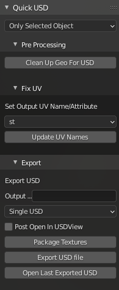

# Quick USD

Use this Blender Addon to cleanly export meshes from Blender to separate .usda files with textures applied along with being neatly packaged in it's own folder.



[v0.3.0 Walkthrough Video](https://youtu.be/ghcS-naIF_U)

# Requirements

These are **HARD** requirements, otherwise Quick USD won't be able to apply the textures, only save out and package up the USD.

<u>**YOU NEED TO HAVE USD INSTALLED FOR THE MAIN PYTHON ENVIRONMENT ON YOUR PC**</u>

- Python 3.6.7 - **<u>REQUIRED FOR PYTHON USD!</u>** Set as Main Python for PC through environment variables.

  - Install PySide2 and PyOpenGL to python, e.g., ```python -m pip install PySide2 PyOpenGL```

- USD Binaries installed
  - [Use & Install the Nvidia Prebuilt Binaries here for less headache](https://developer.nvidia.com/usd#bin)

- Add %USDROOT%\bin and %USDROOT%\lib to the front of %PATH%

- Add %USDROOT%\lib\python to the front of %PYTHONPATH%

  

  

### Test USD Install to Verify

Open a terminal and attempt these commands to make sure USD is properly setup.

1. ```usdcat.cmd %USDROOT%\share\usd\tutorials\convertingLayerFormats\Sphere.usd```  should return : 

```
#usda 1.0

def Sphere "sphere"
{
}

```

2. ```usdview.cmd %USDROOT%\share\usd\tutorials\traversingStage\HelloWorld.usda ```should bring up usdview with a simple Sphere

3. Check python setup with ``` import pxr``` . It should not error out or say pxr is missing.

# Bugs

- Single material slot export and application only

# Usage

## Single Object Export

1. Select Mesh to export

2. Open Quick USD addon Tab

3. Set Selection Dropdown to ```Only Selected``` so only the selected mesh is exported.

4. Paste in the Directory you want to save the newly packaged USD to.

   1. ex : ```C:\Temp\Building``` will create ```C:\Temp\Bulding\Doorway``` etc.

5. Click the Export to USD button to export the newly packaged USD file and dependencies.

   Your newly packaged USDa should now be available.


## Multi Object Export

1. Select Mesh to export

2. Open Quick USD addon Tab

3. Set Selection Dropdown to either ```All Objects In Scene``` or ```Active Collection``` so only the selected mesh is exported.

4. Paste in the Directory you want to save the newly packaged USDs to.

   1. ex : ```C:\Temp\Building``` will create ```C:\Temp\Bulding\Doorway``` etc.

5. Click the Export to USD button to export the newly packaged USDs file and dependencies.

   Your newly packaged USDa(s) should now be available.

